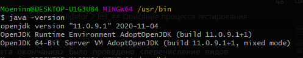

# Отчёт о установке JDK и тестировании KeyValidator

В результате тестирования выявлены следующие дефекты:
* 1 https://github.com/Bogdmoen/jvqa1.1/issues/1
* 2 https://github.com/Bogdmoen/jvqa1.1/issues/2

## Описание процесса тестирования

1. Установка OpenJDK производилась на ситсему WIN10 x64.
В проецессе установки по инструкции проблем не возникло.

2. Приложение KeyValidator запускается и польностью совместимо с java 11.

Тестирование производилось в следующем окружении:
* Win 10 x64
* Java 11.0.9.1

